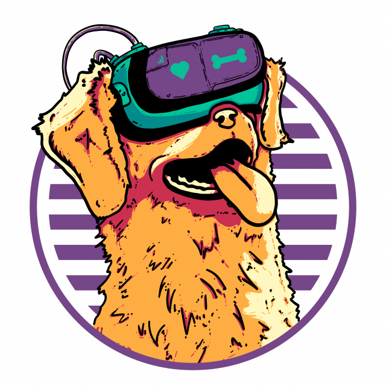
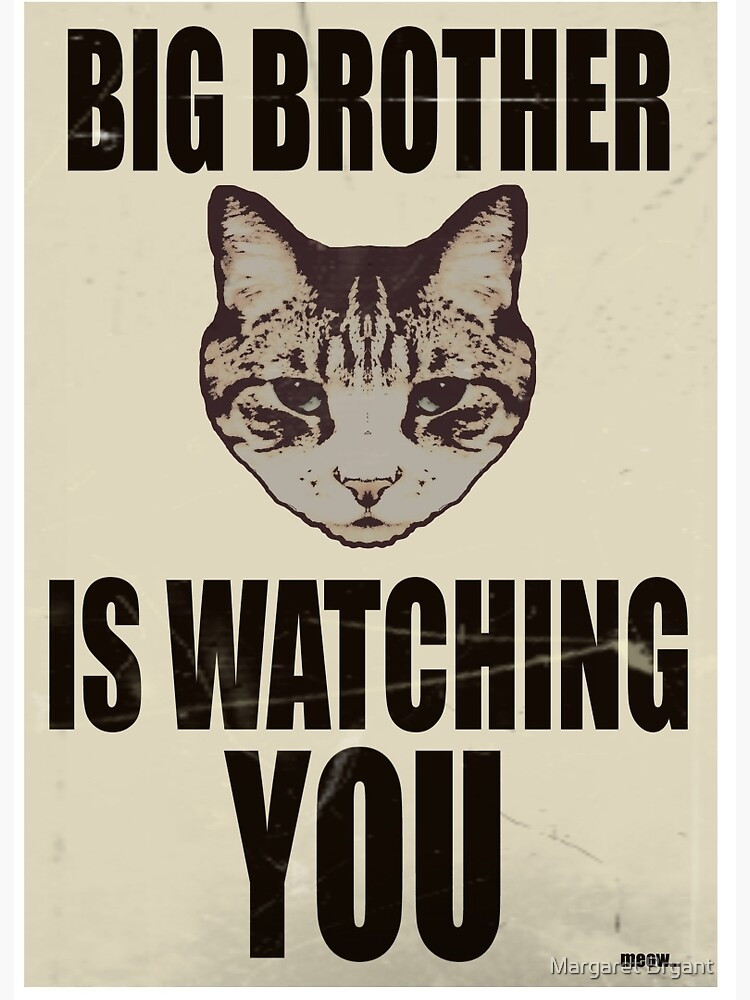

# Challenge - Catpunk Steganography




Olá camarada!

Em um futuro alternativo vivemos numa distopia. Estamos em 2077 e vivemos sob regime opressor controlado por gatinhos, fomos escravizados obrigados a passar horas a acariciar, abanar, chacoalhar brinquedos e a trabalhar em fábricas de produção de sachês e petiscos, nem George Orwell seria capaz de prever um futuro tão devastador.
Mas uma força de resistência denominada Cãofraria, uma organização secreta revolucionária planeja derrubar esse regime. Mas nesse futuro somos constantemente vigiados e para que a revolução tenha sucesso temos uma missão para você.

A missão: Crie uma solução capaz de enviar mensagens escondidas para outros membros da revolução.  
Como: Utilize a técnica de esteganografia, mais precisamente, esteganografia em imagens utilizando o algoritmo LSB ([Least Significant Bit](#apendice-a))

## Requisitos:

- Você define qual linguagem de programação usar, pense em eficiência, escalabilidade e legibilidade;
- Você deve implementar utilizando apenas bibliotecas padrão da linguagem de programação escolhida;
- Cria a documentação do seu código, sua solução deve ser acessível para qualquer usuário;
- Implemente testes, você deve garantir que sua solução funciona;


## Entregaveis:

Crie sua solução como uma API Rest e que deve ser capaz de esconder e revelar a mensagem em uma imagem;

Se quiser tornar sua solução ainda mais completa, desenvolva uma interface que consome a sua API. Você pode desenvolver utilizando um framework como React ou Angular


## Aqui vão algumas dicas:

Não se preocupe, temos algumas que podem ajudar, vamos lá!
- Travou em alguma parte, não se preocupe, se não estiver conseguindo fazer algumas das etapas pule, faça o máximo que puder.
- Caso precise de ajuda, sinta-se à vontade para entrar em [pra gente](mailto:time@cromai.com) perguntando ou pedindo explicações!
- Assim que finalizar a grande missão, mande todas informações [pra gente](mailto:time@cromai.com) com o link do seu github. 
- Lembre-se de colocar o nome da vaga no assunto do e-mail.

Uma dica para seu algoritmo de esteganografia, uma mensagem comporta sempre uma frase, terminando sempre com o caractere "`.`" (ou em binário `00101110`). Assim você não precisa vasculhar a imagem inteira.

Para sua API, recomendamos a criação de ao menos três endpoints e seus respectivos métodos HTTP:
- `/image`: Uma requisição POST que recebe um ***multipart/form-data*** com uma imagem **bitmap** e retorna a identificação única do arquivo armazenado em um diretório temporário do servidor;
- `/image`: Uma requisição GET que recebe na query a identificação da imagem pós processada a ser acessada e retorna o arquivo para download;
- `/encode`: Uma requisição POST que recebe um ***application/json*** com a identificação da imagem (gerada após o upload para o servidor), aplica um algoritmo de Esteganografia (será descrito melhor abaixo) retornando um JSON informando a identificação da imagem do novo arquivo gerado;
- `/decode`: Uma requisição GET que recebe na query a identificação do arquivo de imagem a ser decodificada e retorna a mensagem escondida na imagem;

# Apendice A

O algoritmo de [Esteganografia deve ser do tipo LSB (Least Significant Bit)](https://zenodo.org/record/262996/files/Chapter%2017.pdf?download=1), funciona mais ou menos assim:

Gostaríamos de escrever a letra “A” usando o algoritmo de esteganografia LSB.  
```
1 - A letra pode ser representada em ASCII binário como 01000001.  
2 - Devemos separar cada um dos bits: [0 1 0 0 0 0 0 1].  
3 - Pegar os 8 primeiros bytes da imagem original:

``` 

| byte 0 | byte 1 | byte 2 | byte 3 | byte 4 | byte 5 | byte 6 | byte 7 |
| :-- | :-- | :-- | :-- | :-- | :-- | :-- | :-- |
| `10010000` | `10011010` | `10011100` | `10010010` | `10010110` | `10011101` | `10101111` | `10100101` |

E Devemos substituir os ultimos bits de cada um dos bytes por 1 bit da mensagem. Ficando assim:

| byte 0 | byte 1 | byte 2 | byte 3 | byte 4 | byte 5 | byte 6 | byte 7 |
| :-- | :-- | :-- | :-- | :-- | :-- | :-- | :-- |
| `10010000` | `10011011` | `10011100` | `10010010` | `10010110` | `10011100` | `10101110` | `10100101` |


### Imagem de Exemplo
 

## Algumas referências que podem te ajudar:

- [BMP File Format](https://www.digicamsoft.com/bmp/bmp.html)
- [Bits to Bitmaps: A simple walkthrough of BMP Image Format - Uday Hiwarale](https://medium.com/sysf/bits-to-bitmaps-a-simple-walkthrough-of-bmp-image-format-765dc6857393)
- [Data Hiding Using Least Significant Bit Steganography in Digital Images - B.Chitradevi, N.Thinaharan and M.Vasanthi](https://zenodo.org/record/262996/files/Chapter%2017.pdf?download=1)
- [Tabela ASCII](https://www.ime.usp.br/~kellyrb/mac2166_2015/tabela_ascii.html)
